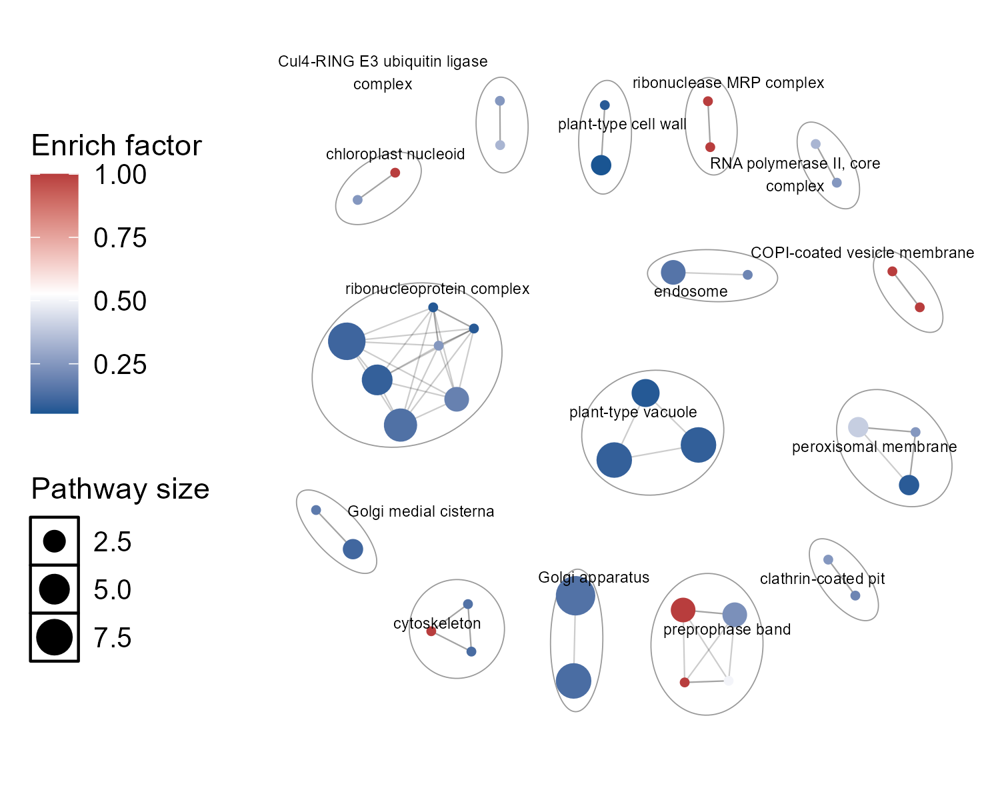
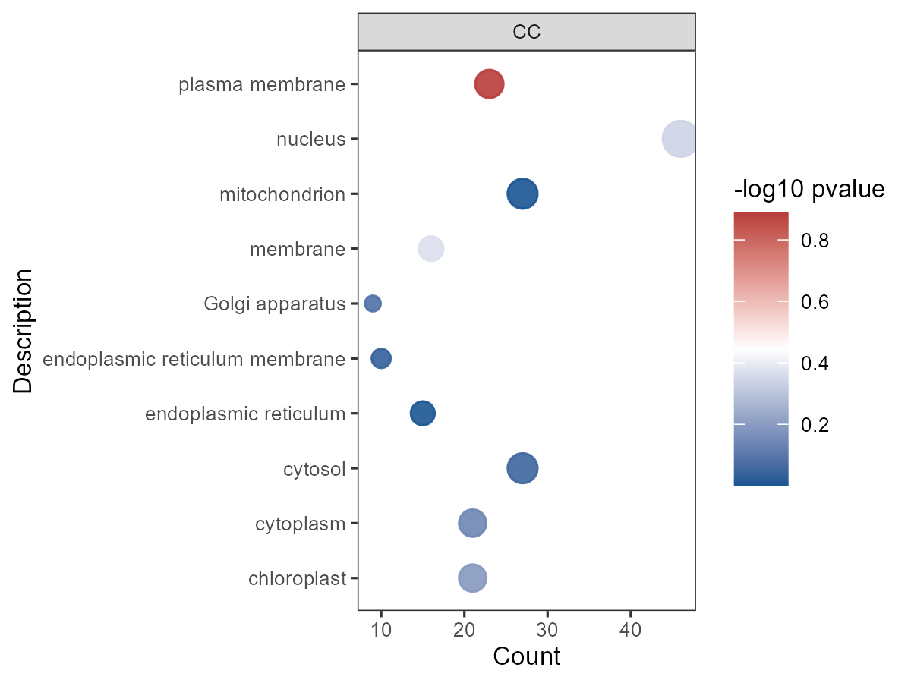
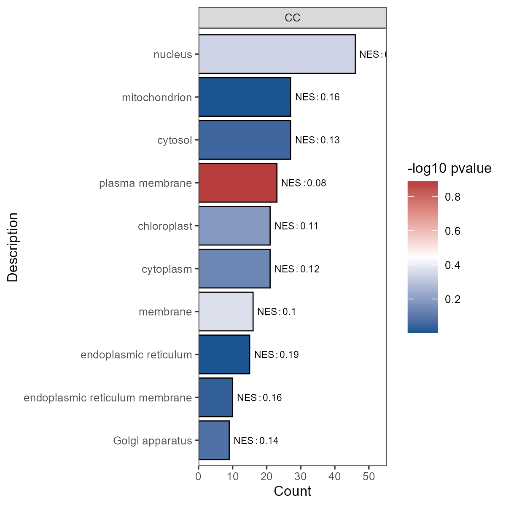

```{r setup, include=FALSE}
knitr::opts_chunk$set(echo = TRUE)
```

## ZCPstates

ZCPstates is an R package primarily designed for proteomics data analysis. It will be continuously updated with new features, covering the entire proteomics workflow as well as general statistical analysis and visualization tools.

## Installation

```{r}
if(!require(devtools)){install.packages("devtools")}
devtools::install_github("Chuanping-Zhao/ZCPstates")
```

## Example for local enrichment analysis

This package provides the `uniprotEnrich()` function for analyzing proteomics search database results. Users only need to supply the UniProt database with the same Taxonomy ID as the search fasta file. Additionally, the package offers visualization options [`uniprotEnrich_plot()`] for the results of the `uniprotEnrich()` function, including enrichment network visualization based on the `aPEAR` package, as well as conventional scatter plot and bar chart visualizations:

```{r, echo=FALSE}
library(ZCPstates)
data("uniprotEnrich.demo.diff", package = "ZCPstates")
data("uniprotEnrich.demo.library.uniprot", package = "ZCPstates")
```

The input format for differential analysis data is as follows:

```{r}
uniprotEnrich.demo.diff
```

The UniProt database format should include the following mandatory columns(`Entry`,`Pathway`,`Gene Ontology (biological process)`, `Gene Ontology (cellular component)`,`Gene Ontology (molecular function)`), which are essential for the enrichment analysis:

```{r}
uniprotEnrich.demo.library.uniprot
```

After inputting the above two datasets and setting the corresponding parameters, all enrichment results will be generated in the specified folder:

```{r}
 result <- ZCPstates::uniprotEnrich(
   dt = uniprotEnrich.demo.diff,
   library=uniprotEnrich.demo.library.uniprot,
   protein.col.name="Entry",
   Protein.separator=";",
   diff.condition.col.name="Sig",
   diff.markers=c("Up","Down","NotSig"),
   dt.include.allproteins=TRUE,
    cutoff=1,
    savefile="outputfile"
 )

tibble::as_tibble(result$all$pathway_enrich_result)
```

Subsequently, extract the required data from `result`, and use the `uniprotEnrich_plot()` function to complete the visualization:

plotting network:

```{r}
go.cc=as.data.frame(result$Up$go_enrichment) |>  dplyr::filter(Type=="CC")
plt.go.cc.network=ZCPstates::uniprotEnrich_plot(dt = uniprotEnrichplot.demo.GO.CC, plot.type = c("bar","point","network")[3],enrich.type=c("pathway","GO")[2], GO.subset=c("BP","CC","MF","All")[2],network.fontsize=2,network.minclustersize=2,network.simMethod=c("jaccard", "cosine", "cor")[1]) 
ZCPstates::save_zcp(Fig = plt.go.cc.network,FigName = "plt.go.cc.network",outputfile = "Figure",widths = 5,heights = 4,ppt = F)

```


plotting scatter plots:

```{r}
go.cc.top10=go.cc |> dplyr:: slice_max(order_by = counts, n = 10)
plt.go.cc.top10.scatter=uniprotEnrich_plot(dt = go.cc.top10,plot.type = c("bar","point","network")[2], enrich.type=c("pathway","GO")[2],GO.subset=c("BP","CC","MF","All")[2]) 
ZCPstates::save_zcp(Fig = plt.go.cc.top10.scatter,FigName = "plt.go.cc.top10.scatter",outputfile = "Figure",widths = 4,heights =3,ppt = F)
```


plotting bar charts:

```{r}
plt.go.cc.top10.bar=uniprotEnrich_plot(dt = go.cc.top10,plot.type = c("bar","point","network")[1], enrich.type=c("pathway","GO")[2],GO.subset=c("BP","CC","MF","All")[2]) 
ZCPstates::save_zcp(Fig = plt.go.cc.top10.bar,FigName = "plt.go.cc.top10.bar",outputfile = "Figure",widths = 4,heights =4,ppt = F)
```



Additional functions will be added in future updates. If you encounter any bugs or issues, please contact me via GitHub or the WeChat public account [`MS driven Multiomics`].
