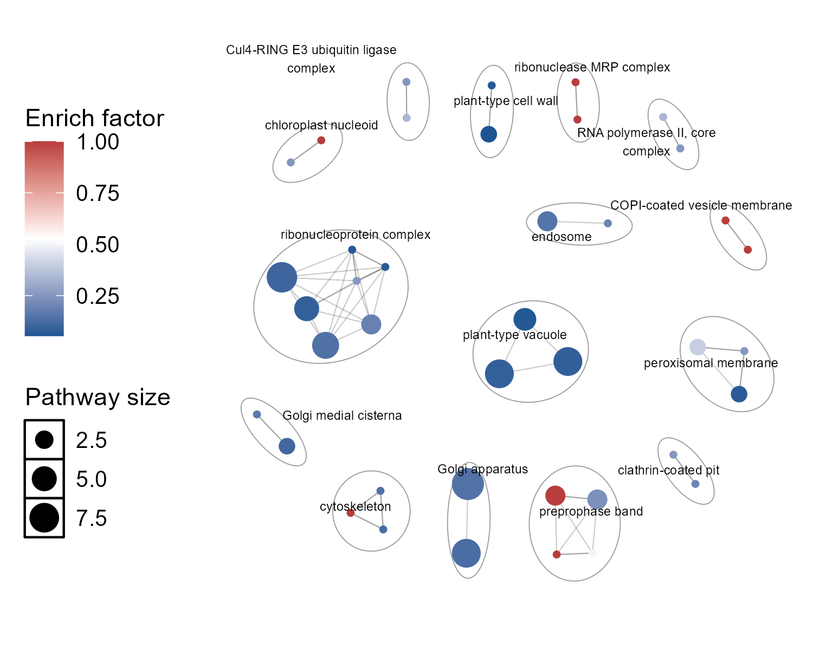

read me
================
zcp
2024-12-22

## ZCPstates

ZCPstates is an R package primarily designed for proteomics data
analysis. It will be continuously updated with new features, covering
the entire proteomics workflow as well as general statistical analysis
and visualization tools.

## Installation

``` r
if(!require(devtools)){install.packages("devtools")}
devtools::install_github("Chuanping-Zhao/ZCPstates")
```

    ## Using GitHub PAT from the git credential store.

    ## Skipping install of 'ZCPstates' from a github remote, the SHA1 (fb1633d0) has not changed since last install.
    ##   Use `force = TRUE` to force installation

## Example for local enrichment analysis

This package provides the `uniprotEnrich()` function for analyzing
proteomics search database results. Users only need to supply the
UniProt database with the same Taxonomy ID as the search fasta file.
Additionally, the package offers visualization options
\[`uniprotEnrich_plot()`\] for the results of the `uniprotEnrich()`
function, including enrichment network visualization based on the
`aPEAR` package, as well as conventional scatter plot and bar chart
visualizations:

The input format for differential analysis data is as follows:

``` r
uniprotEnrich.demo.diff
```

    ## # A tibble: 2,000 × 2
    ##    Entry  Sig   
    ##    <chr>  <chr> 
    ##  1 Q0WLC6 Up    
    ##  2 O82533 NotSig
    ##  3 P0C2F5 NotSig
    ##  4 Q9C9L4 NotSig
    ##  5 Q9SMP2 NotSig
    ##  6 Q9M2Q6 NotSig
    ##  7 Q8LE43 NotSig
    ##  8 A4FVR1 NotSig
    ##  9 O65258 NotSig
    ## 10 Q680P8 NotSig
    ## # ℹ 1,990 more rows

The UniProt database format should include the following mandatory
columns(`Entry`,`Pathway`,`Gene Ontology (biological process)`,
`Gene Ontology (cellular component)`,`Gene Ontology (molecular function)`),
which are essential for the enrichment analysis:

``` r
uniprotEnrich.demo.library.uniprot
```

    ## # A tibble: 16,318 × 21
    ##    Entry      Reviewed `Entry Name` `Protein names` `Gene Names` Organism Length Gene Ontology (biolo…¹ Gene Ontology (cellu…² Gene Ontology (molec…³ `Gene Ontology (GO)`
    ##    <chr>      <chr>    <chr>        <chr>           <chr>        <chr>    <chr>  <chr>                  <chr>                  <chr>                  <chr>               
    ##  1 A0A0A7EPL0 reviewed PIAL1_ARATH  E4 SUMO-protei… PIAL1 EMB30… Arabido… 847    positive regulation o… nucleus [GO:0005634]   ligase activity [GO:0… nucleus [GO:0005634…
    ##  2 A0A178VEK7 reviewed DUO1_ARATH   Transcription … DUO1 MYB125… Arabido… 300    cell cycle G2/M phase… generative cell nucle… DNA-binding transcrip… generative cell nuc…
    ##  3 A0A178WF56 reviewed CSTM3_ARATH  Protein CYSTEI… CYSTM3 At1g… Arabido… 71     negative regulation o… cytoplasm [GO:0005737… <NA>                   cytoplasm [GO:00057…
    ##  4 A0A1I9LMX5 reviewed PCEP9_ARATH  Precursor of C… CEP9 At3g50… Arabido… 243    cellular response to … apoplast [GO:0048046]  hormone activity [GO:… apoplast [GO:004804…
    ##  5 A0A1I9LN01 reviewed LAF3_ARATH   Protein LONG A… LAF3 At3g55… Arabido… 583    de-etiolation [GO:000… membrane [GO:0016020]… hydrolase activity, a… membrane [GO:001602…
    ##  6 A0A1P8AQ95 reviewed STMP4_ARATH  Secreted trans… STMP4 At1g6… Arabido… 97     response to ethylene … apoplast [GO:0048046]… LRR domain binding [G… apoplast [GO:004804…
    ##  7 A0A1P8ASY1 reviewed JHS1_ARATH   DNA replicatio… JHS1 EMB241… Arabido… 1331   DNA damage response [… chromosome [GO:000569… 4 iron, 4 sulfur clus… chromosome [GO:0005…
    ##  8 A0A1P8AUY4 reviewed MDN1_ARATH   Midasin (AtMDN… MDN1 DSR1 A… Arabido… 5400   abscisic acid-activat… chloroplast envelope … ATP binding [GO:00055… chloroplast envelop…
    ##  9 A0A1P8AW69 reviewed KTN81_ARATH  Katanin p80 WD… KTN80.1 At1… Arabido… 1019   microtubule depolymer… cytoplasm [GO:0005737… microtubule binding [… cytoplasm [GO:00057…
    ## 10 A0JQ18     reviewed SOP14_ARATH  Serine rich en… PROSCOOP14 … Arabido… 73     defense response [GO:… apoplast [GO:0048046]… LRR domain binding [G… apoplast [GO:004804…
    ## # ℹ 16,308 more rows
    ## # ℹ abbreviated names: ¹​`Gene Ontology (biological process)`, ²​`Gene Ontology (cellular component)`, ³​`Gene Ontology (molecular function)`
    ## # ℹ 10 more variables: `Gene Ontology IDs` <chr>, BioGRID <chr>, CORUM <lgl>, ComplexPortal <chr>, DIP <chr>, ELM <chr>, IntAct <chr>, MINT <chr>, STRING <chr>,
    ## #   Pathway <chr>

After inputting the above two datasets and setting the corresponding
parameters, all enrichment results will be generated in the specified
folder:

``` r
 result <- ZCPstates::uniprotEnrich(
   dt = uniprotEnrich.demo.diff,
   library=uniprotEnrich.demo.library.uniprot,
   protein.col.name="Entry",
   Protein.separator=";",
   diff.condition.col.name="Sig",
   diff.markers=c("Up","Down","NotSig"),
   dt.include.allproteins=TRUE,
    cutoff=1,
    savefile="outputfile"
 )
```

    ## zcp: 'outputfile' already exists!All results have been saved to outputfile --zcp

``` r
tibble::as_tibble(result$all$pathway_enrich_result)
```

    ## # A tibble: 63 × 8
    ##    Pathway                                                    proteincounts.per.pahtway.all counts p_value   FDR Enrich_factor hited.proteins                        Type 
    ##    <chr>                                                                              <int>  <int>   <dbl> <dbl>         <dbl> <chr>                                 <chr>
    ##  1 Phospholipid metabolism                                                                4      2   0.763 0.876         0.5   A4GNA8/Q9SYC8                         Path…
    ##  2 phosphatidylethanolamine biosynthesis                                                  1      1   0.765 0.876         1     A4GNA8                                Path…
    ##  3 phosphatidylethanolamine from CDP-diacylglycerol: step 2/2                             1      1   0.765 0.876         1     A4GNA8                                Path…
    ##  4 Metabolic intermediate biosynthesis                                                    4      2   0.763 0.876         0.5   P43256/Q8S4Y1                         Path…
    ##  5 (R)-mevalonate biosynthesis                                                            2      2   0.945 0.975         1     P43256/Q8S4Y1                         Path…
    ##  6 (R)-mevalonate from acetyl-CoA: step 3/3                                               1      1   0.765 0.876         1     P43256                                Path…
    ##  7 Carbohydrate metabolism                                                                4      1   0.342 0.876         0.25  P93033                                Path…
    ##  8 tricarboxylic acid cycle                                                               3      1   0.447 0.876         0.333 P93033                                Path…
    ##  9 (S)-malate from fumarate: step 1/1                                                     1      1   0.765 0.876         1     P93033                                Path…
    ## 10 Protein modification                                                                  75     19   0.604 0.876         0.253 Q0WX00/Q8VZS9/Q93Z16/Q9LFU0/Q9XGM8/Q… Path…
    ## # ℹ 53 more rows

Subsequently, extract the required data from `result`, and use the
`uniprotEnrich_plot()` function to complete the visualization:

plotting network:

``` r
go.cc=as.data.frame(result$Up$go_enrichment) |>  dplyr::filter(Type=="CC")
plt.go.cc.network=ZCPstates::uniprotEnrich_plot(dt = uniprotEnrichplot.demo.GO.CC, plot.type = c("bar","point","network")[3],enrich.type=c("pathway","GO")[2], GO.subset=c("BP","CC","MF","All")[2],network.fontsize=2,network.minclustersize=2,network.simMethod=c("jaccard", "cosine", "cor")[1]) 
ZCPstates::save_zcp(Fig = plt.go.cc.network,FigName = "plt.go.cc.network",outputfile = "Figure",widths = 5,heights = 4,ppt = F)
```

    ## zcp: Figure already exists!

<figure>

<figcaption aria-hidden="true">plt.go.cc.network</figcaption>
</figure>

plotting scatter plots:

``` r
go.cc.top10=go.cc |> dplyr:: slice_max(order_by = counts, n = 10)
plt.go.cc.top10.scatter=uniprotEnrich_plot(dt = go.cc.top10,plot.type = c("bar","point","network")[2], enrich.type=c("pathway","GO")[2],GO.subset=c("BP","CC","MF","All")[2]) 
ZCPstates::save_zcp(Fig = plt.go.cc.top10.scatter,FigName = "plt.go.cc.top10.scatter",outputfile = "Figure",widths = 4,heights =3,ppt = F)
```

    ## zcp: Figure already exists!

<figure>

<figcaption aria-hidden="true">plt.go.cc.top10.scatter</figcaption>
</figure>

plotting bar charts:

``` r
plt.go.cc.top10.bar=uniprotEnrich_plot(dt = go.cc.top10,plot.type = c("bar","point","network")[1], enrich.type=c("pathway","GO")[2],GO.subset=c("BP","CC","MF","All")[2]) 
ZCPstates::save_zcp(Fig = plt.go.cc.top10.bar,FigName = "plt.go.cc.top10.bar",outputfile = "Figure",widths = 4,heights =4,ppt = F)
```

    ## zcp: Figure already exists!

<figure>

<figcaption aria-hidden="true">plt.go.cc.top10.bar</figcaption>
</figure>

Additional functions will be added in future updates. If you encounter
any bugs or issues, please contact me via GitHub or the WeChat public
account \[`MS driven Multiomics`\].
